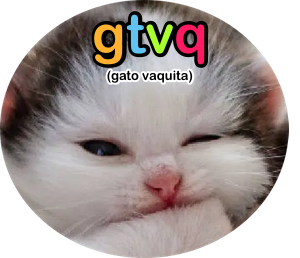
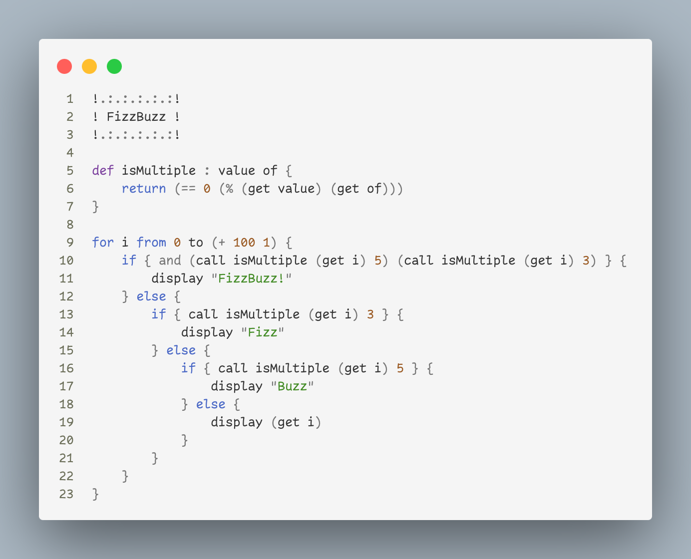

# gtvq (gato vaquita)

gtvq is a cursed programming language experiment. It takes some things from lisp (I guess), some things from tcl (I guess as well, I've not used them).
It looks like it's a functional programming language, but I'm sure in some weird cases it isn't. The syntax for the language is absolutely minimal and
no commands are part of its default syntax. That's the core concept behind the language, you can add your own commands that in turn call a function
that makes gtvq do whatever you want with the arguments that command receives.

This is an experiment written in Python that's that, just an experiment. If I decide to continue working on this, I'll probably migrate it to C++ and
continue from there in another repository.

If you want to try it for yourself, do `python3 gtvq.py [source file]`, such as `python3 gtvq.py examples/disancount.gtvq`.

## The Syntax
- A source file in gtvq is a sequence of lines which are in turn sequences of "commands" (i.e. words), lists and string.
- A command tells gtvq to do something with all the words after it in the line.
- A string is a word or a series of words wrapped in ". Other than that, they are the same as regular commands.
- Then there's () and {}. () is a subexecution: the code inside the () is considered its own line and its interpreted before the line that contained the ().
Once that returns a value, the original () sequence is replaced by said value. I.e. they are used to solve expressions in execution time.
- {} is a block of code. Whatever you put inside it will be treated as a different source file (but not executed). gtvq exposes the `execute_code` function
to let command writters execute code from {} blocks. Other than that, they are strings. In fact, you can also execute strings. The only difference between
{} blocks and strings is that strings turn sequences such as \n into special characters.

## Screenshots

## License
I hereby release gtvq under the apache 2 license. The cat picture is not mine, I don't know who took it, sorry!
